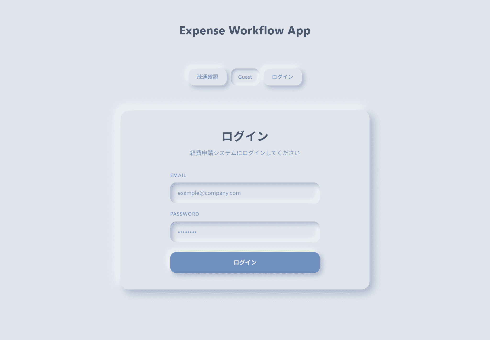
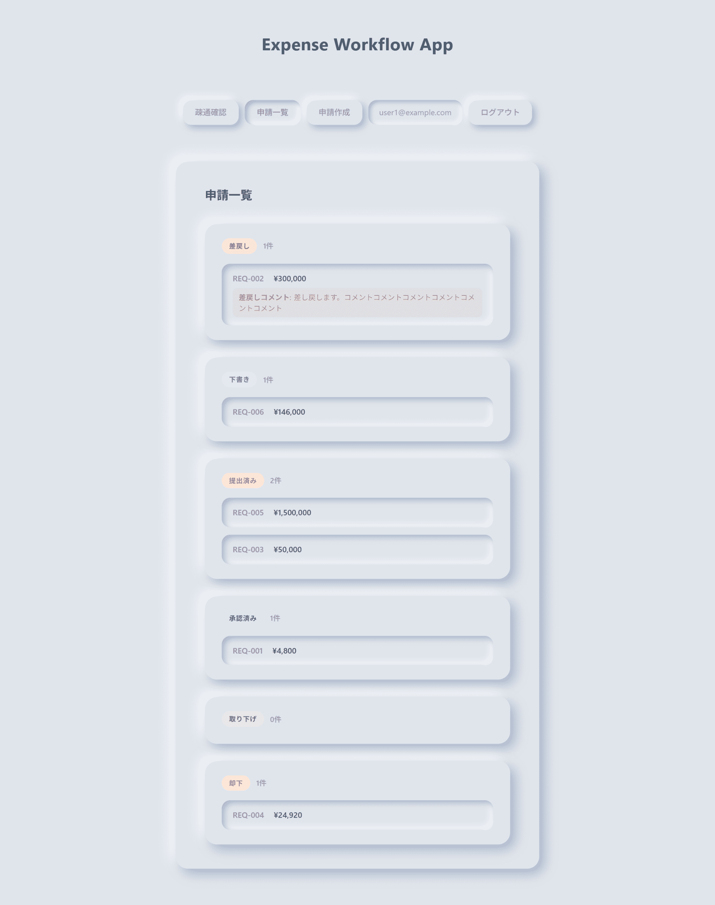
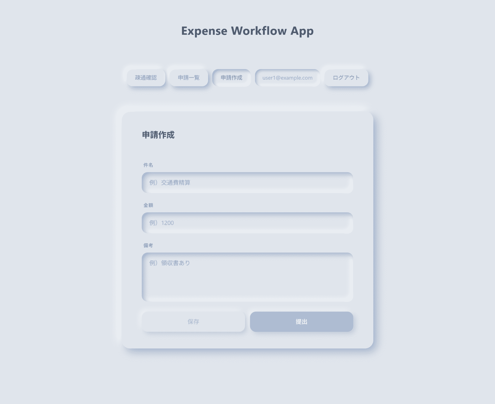
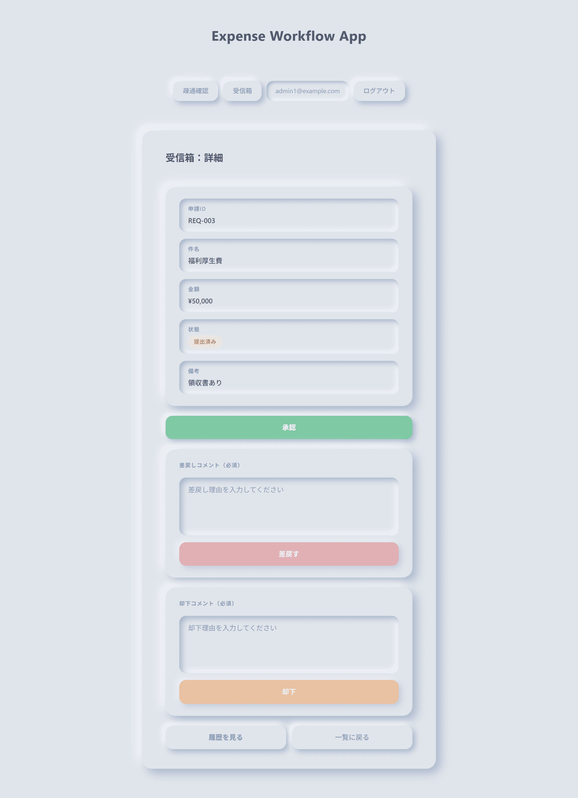
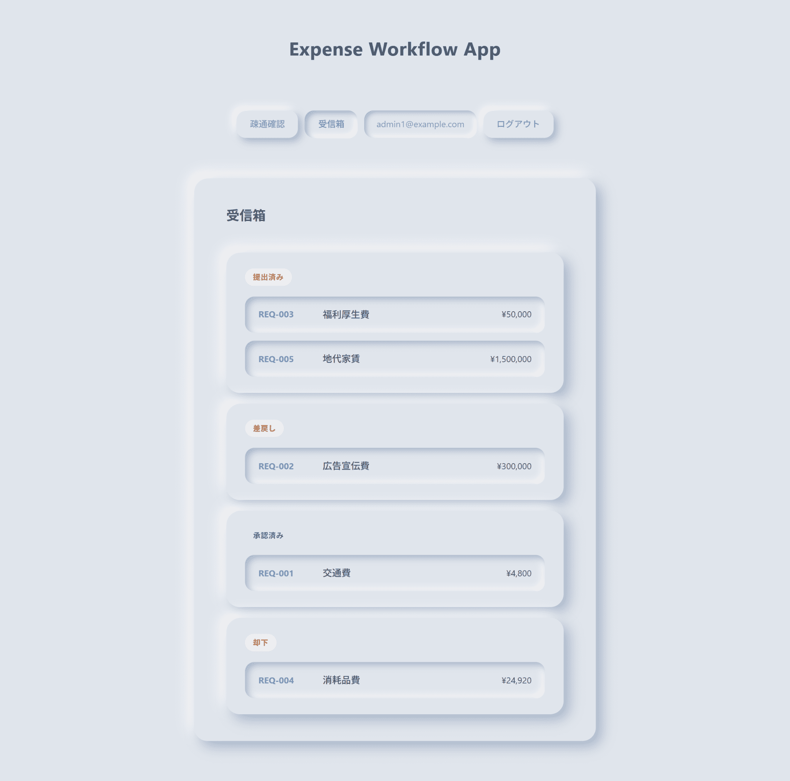

# Workflow App（経費申請・承認ワークフロー）

React + Java/Spring Boot で構築した、業務向けの申請・承認フローアプリです。
ロールベースの権限管理・申請ステータス管理・操作履歴など、実務アプリの典型要素を一通り実装しています。

🔗 **デモURL**：https://pretty-youthfulness-production-next.up.railway.app/
※ テスト用アカウントは下記「デモ用ログイン情報」を参照してください。

> ⚠️ **初回アクセス時の注意**
> 一定時間アクセスがないとサーバーがスリープします。
> 初回表示に失敗した場合は、**30〜60秒待ってから再度アクセス**してください。

---

## 🔑 デモ用ログイン情報

| ロール       | メールアドレス     | パスワード |
| ------------ | ------------------ | ---------- |
| 一般ユーザー | user1@example.com  | password   |
| 承認者       | admin1@example.com | password   |

---

## 📸 スクリーンショット

### ログイン画面



### 申請一覧（一般ユーザー）



### 申請作成



### 承認・差戻し画面



### 操作履歴




---

## ✅ 実装済み機能

| 機能                 | 概要                                           |
| -------------------- | ---------------------------------------------- |
| ログイン・ログアウト | Spring Security によるセッション認証           |
| ロール別表示         | 一般ユーザー／承認者でメニュー・操作を切り替え |
| 申請作成             | 経費申請フォームの入力・登録                   |
| 申請一覧・詳細       | 申請のステータス確認・詳細表示                 |
| 承認・差戻し         | 承認者によるステータス更新・コメント付与       |
| 操作履歴             | 申請ごとの承認・差戻し履歴をタイムライン表示   |

---

## 🛠 技術スタック

### フロントエンド（Next.js 版・公開中）

- TypeScript 5
- Next.js 16
- React 19
- Jotai 2（状態管理）
- TanStack Query v5（サーバー状態管理）
- Axios

### フロントエンド（Vite 版）

- TypeScript 6
- React 19
- Vite 7
- React Router v7
- Jotai 2（状態管理）
- TanStack Query v5（サーバー状態管理）
- Tailwind CSS 4
- Axios

### バックエンド

- Java 17
- Spring Boot 3
- Spring Security（セッション認証）
- MyBatis
- MySQL 8

### インフラ

- Railway（フロントエンド・バックエンド・DB をそれぞれデプロイ）

---

### 🗂 リポジトリ構成

```
expense-workflow-react-springboot/
├── _screenshots/
├── expense-workflow-nextjs/         # Next.js 版フロントエンド（公開中）
├── frontend/
│   └── expense-workflow-frontend/   # Vite 版フロントエンド
├── backend/                         # Spring Boot アプリ
└── railway.json
```

---

### 🚀 ローカル起動手順

## 前提条件

- Node.js 20以上
- Java 17以上
- MySQL 8（またはDockerでMySQL起動）

## 1. リポジトリをクローン

```bash
git clone https://github.com/private-enpitsu/expense-workflow-react-springboot.git
cd expense-workflow-react-springboot
```

## 2. バックエンド起動

```bash
cd backend

# application.properties に DB 接続情報を設定（下記参照）
./gradlew bootRun
```

`application.properties` の設定例：

```properties
spring.datasource.url=jdbc:mysql://localhost:3306/workflow_db
spring.datasource.username=root
spring.datasource.password=yourpassword
```

## 3. フロントエンド起動

## Next.js 版（公開URLと同構成）

```bash
cd expense-workflow-nextjs
npm install
npm run dev
```

ブラウザで `http://localhost:3000` を開く。

## Vite 版

```bash
cd frontend/expense-workflow-frontend
npm install
npm run dev
```

ブラウザで `http://localhost:5173` を開く。

---

## 📐 主要な設計ポイント

### ロールベースアクセス制御（RBAC）

Spring Security の設定でエンドポイントごとにロールを制限。フロントエンドもロールに応じてメニュー・ボタンの表示を切り替えています（一般ユーザー／承認者）。

### 申請ステータスの状態遷移

```
下書き → 申請中 → 承認済み
                → 差戻し → 申請中（再申請）
```

### セッション認証とCORS対応

フロントエンド（Railway）とバックエンド（Railway）がクロスドメインのため、`SameSite=None; Secure` の Cookie 設定で対応。

### 操作履歴の記録

承認・差戻しのたびに操作者・日時・コメントをDBに記録。申請詳細画面でタイムライン表示。

---

## 📄 License

MIT
